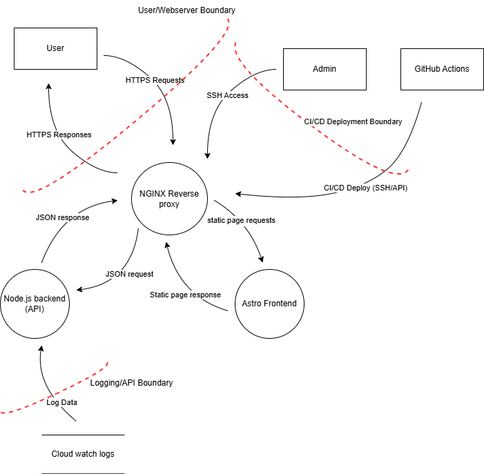

# Threat Model Information

## 1. 📌 Scope of Work

### 1.1 Application Overview

**Application Version:** 1.0
**Description:** The Resume & Portfolio Website is a personal project designed to showcase the developer’s resume, project experience, technical skills, and DevSecOps practices in a publicly accessible format. The site is also used to securely collect messages via a contact form, with future plans to integrate OAuth-based authentication for personalised or gated content.

There are three types of users that interact with the application:

1. General Visitors

2. Recruiters / Hiring Managers

3. The Developer (Owner/Admin)

General Visitors can view the public resume, browse showcased projects, and optionally use the contact form to send a message. Recruiters can access the same content but may additionally verify security practices and CI/CD pipelines for professional evaluation. The Developer maintains and updates the website and pipeline, reviews contact submissions, and may use admin-only functionality in the backend (via OAuth in the future).

**Document Owner:** Jugal Nayal
**Participants:** Jugal Nayal
**Reviewer:** Jugal Nayal

### 1.2 External Dependencies

| ID | Description |
|----|-------------|
| 1 | The resume website will be hosted on an AWS EC2 instance running Ubuntu. This server will be hardened using AWS and CIS hardening best practices. It includes latest OS updates, restricted ports, and application security patches. |
| 2 | The Node.js backend API will use third-party libraries (e.g., `express`, `jsonwebtoken`, `helmet`, `express-rate-limit`) managed via `npm`. These dependencies will be scanned for known vulnerabilities using SCA tools in CI (e.g., `npm audit`, `Snyk`). |
| 3 | Nginx will be used as a reverse proxy for both the Astro frontend and Node.js backend. It will be configured with secure headers and hardened according to security best practices. |
| 4 | All public access to the website will be served over HTTPS using TLS certificates issued (TLS certificate provider not yet decided). |
| 5 | Application logs will be sent to AWS CloudWatch for centralized logging and future monitoring integration (SIEM or detection logic). |
| 6 | Deployment automation is performed using GitHub Actions, which must be securely configured to avoid secrets leakage and improper access to AWS resources. |
| 7 | Optionally, static assets (e.g., images, documents) may be served from AWS S3 via CloudFront. These buckets will be private by default and public access disabled unless explicitly required. |

### 1.3 Entry points

| ID | Entry Point | Description |
|----|-------------|-------------|
| 1 | Public website access (HTTPS via Nginx) | Users access the Astro frontend and backend API through HTTPS endpoints served by Nginx on the EC2 instance. |
| 2 | Contact form submission (`POST /api/contact`) | Public-facing API endpoint for submitting contact messages, accepts untrusted input from users. |
| 3 | GitHub Actions Webhook | GitHub pushes trigger CI/CD workflows that deploy code to EC2. This is an automated integration and a sensitive entry point. |
| 4 | SSH Access to EC2 | The developer/admin can access the server via SSH using a secure private key. This is a critical administrative entry point. |
| 5 | OAuth Authentication Callback (planned) | A redirect endpoint to handle responses from third-party OAuth providers (e.g., Google/GitHub), to be implemented for authentication. |
| 6 | Static Asset Access (via CloudFront/S3) | Public users may access static content like images or downloadable files, served via S3 + CloudFront if enabled. |

### 1.4 Exit points

| ID | Exit Point | Description |
|----|------------|-------------|
| 1 | HTTP responses via Nginx | API and static content responses are sent to users via Nginx. These must be validated, sanitised, and use secure headers. |
| 2 | Contact form messages → Email (optional) | If implemented, contact form data may be forwarded via SMTP to an email address for the developer to receive submissions. |
| 3 | Logs → AWS CloudWatch | Application and system logs (backend/API and Nginx) are sent to AWS CloudWatch for centralised monitoring and incident investigation. |
| 4 | OAuth token exchange (planned) | In the future, tokens from third-party OAuth providers will be handled here. Care must be taken not to leak or log token values. |
| 5 | Static files → Public users (via S3/CloudFront) | Publicly accessible content like images, CVs, or downloads may be served from S3 + CloudFront (must be access-controlled appropriately). |

### 1.5 Assets

| ID | Asset | Description | Classification |
|----|-------|-------------|----------------|
| 1 | Contact form submissions | Data submitted via the contact form, potentially containing PII like name, email, and message content. | Sensitive |
| 2 | API endpoints (Node.js) | REST API used to handle contact form data and future features (e.g., authentication, dashboard). | Sensitive |
| 3 | JWT secrets / OAuth tokens | Used for authenticating and authorizing users (future feature). Stored as secrets in backend or GitHub Actions. | Confidential |
| 4 | Application logs | Backend logs, error messages, access logs, stored in AWS CloudWatch. Can expose behavior or PII if misconfigured. | Sensitive |
| 5 | Static frontend (Astro build) | Contains the HTML/CSS/JS for the public-facing website. Generally safe but should not expose internals or hardcoded secrets. | Public |
| 6 | AWS EC2 instance | Hosts the live application. Misconfiguration can lead to total compromise. | Critical |
| 7 | Nginx configuration | Reverse proxy, HTTPS termination, and header settings — improper configuration could weaken security posture. | Sensitive |
| 8 | GitHub Actions workflows | Used for CI/CD deployments; can expose secrets or modify infra if compromised. | Critical |
| 9 | S3 buckets (optional) | May store static files, resumes, images. Must be access-controlled. | Sensitive |

### 1.6 Trust levels

| ID | Entity | Description | Trust Level | Access Scope |
|----|--------|-------------|-------------|--------------|
| 1 | Public Users | Anyone on the internet accessing the resume site via a browser. No authentication required. | Untrusted | Can view public pages, submit contact form |
| 2 | Authenticated Users (planned) | Future users who log in via OAuth. Identity is verified by a trusted identity provider. | Semi-trusted | Access protected resources (e.g., admin dashboard, private project links) |
| 3 | Developer / Site Owner | Maintains and updates the site, manages the AWS server, GitHub repo, and secrets. | Fully trusted | Full access to source code, secrets, EC2, GitHub Actions, and logs |
| 4 | Nginx Reverse Proxy | Sits in front of the application; routes and terminates HTTPS requests. Trusted in runtime context. | Trusted Runtime Component | Controls and forwards all frontend and API traffic |
| 5 | Node.js Backend | Handles API logic, JWT validation, and backend services. Trusted to enforce application logic securely. | Trusted Runtime Component | Full access to business logic, contact form data, and logs |
| 6 | GitHub Actions Runner | Used for CI/CD; runs automated builds, deployments, scans. Accesses secrets and EC2. | Trusted Automation | Access to AWS via IAM credentials, deploys to prod |
| 7 | AWS EC2 Instance | Hosts Nginx, frontend, and backend services. Can be accessed via SSH by the developer. | Trusted Infra Component | Must be hardened, monitored, and patched |
| 8 | CloudWatch Logs | Stores logs from backend and Nginx. Used for debugging and future monitoring. | Trusted Infra Component | Read/write access from EC2; read access by developer |

### 1.7 DFD

## 2. 📌 Threat Determination (STRIDE)

| ID | STRIDE Category | Component / Flow | Threat Description | Impact | Likelihood | Risk |
|----|------------------|-------------------|---------------------|--------|-------------|------|
| T1 | Spoofing | JWT-based auth | Attacker uses forged or stolen JWT to impersonate a user | High | Medium | High |
| T2 | Spoofing | GitHub Actions or SSH access | Compromise of CI/CD or admin SSH could result in takeover | Critical | Low | High |
| T3 | Tampering | Contact Form Input | Injection of malicious payloads (e.g., HTML, JS) | Medium | Medium | Medium |
| T4 | Tampering | CI/CD pipeline | Modifying build steps to inject malware | High | Low | Medium |
| T5 | Repudiation | API Access Logs | Lack of log integrity may allow users to deny malicious actions | Medium | Low | Low |
| T6 | Information Disclosure | S3/Static Files (if public) | Public access to private assets (e.g., resume with PII) | High | Medium | High |
| T7 | Information Disclosure | API responses | Accidental leak of email addresses, stack traces, or system errors | Medium | Medium | Medium |
| T8 | Denial of Service | API Abuse | Spamming `/api/contact` endpoint to flood logs or CPU | High | High | High |
| T9 | Denial of Service | Nginx / EC2 | Resource exhaustion due to malformed requests | Medium | Medium | Medium |
| T10 | Elevation of Privilege | Misconfigured OAuth Scopes (future) | OAuth token grants more access than intended | High | Low | Medium |
| T11 | Elevation of Privilege | GitHub Actions IAM Role | Over-privileged CI role may alter AWS resources | High | Medium | High |

## 3. 📌 Countermeasures and Mitigation

| Threat ID | Mitigation / Control | Description |
|-----------|----------------------|-------------|
| T1 | Strong JWT signing & token validation | Use robust secret keys (env vars), short expiry, validate tokens on each API call |
| T2 | CI/CD and SSH security | Protect SSH keys and GitHub tokens, use IP restrictions, rotate secrets regularly |
| T3 | Input validation and encoding | Use Joi for validation; sanitize and escape user input; prevent HTML/JS injection |
| T4 | Secure CI/CD workflow | Use signed commits, restrict branch write access, scan build artifacts with SAST tools |
| T5 | Audit log integrity | Stream logs to CloudWatch, use log retention, avoid exposing logs to users |
| T6 | S3 access control | Keep buckets private by default, use presigned URLs if access is needed, enable logging |
| T7 | API response hardening | Avoid exposing system messages, use generic error responses, strip debug output in production |
| T8 | Rate limiting | Apply `express-rate-limit` to public endpoints to block abuse |
| T9 | Nginx + resource protection | Limit request size in Nginx, use `ulimit`, restrict simultaneous connections |
| T10 | Least privilege for OAuth | Limit scopes when requesting tokens; validate token issuer and claims |
| T11 | IAM Role Hardening | Apply least privilege to GitHub Actions IAM user; use secrets scanning + monitoring |

## 4. 📌 Work assessment

### Risk Scoring Summary (Qualitative)

| Threat ID | Risk Level | Justification |
|-----------|------------|----------------|
| T1 | High | JWT spoofing could lead to impersonation and unauthorized access |
| T2 | High | CI/CD compromise = total system compromise |
| T3 | Medium | Injection could impact frontend or logs, but mitigated by validation |
| T4 | Medium | CI config tampering is unlikely with GitHub protections |
| T5 | Low | API logs are not user-facing; low risk if rotated securely |
| T6 | High | Misconfigured S3 buckets have led to real-world data breaches |
| T7 | Medium | Leaked error messages or user data could be misused |
| T8 | High | API DoS could render the site unusable |
| T9 | Medium | EC2/Nginx DoS possible, but mitigated by Nginx config + WAF (future) |
| T10 | Medium | OAuth misuse can lead to privilege escalation if not scoped properly |
| T11 | High | GitHub IAM role overreach could affect AWS infrastructure |

---

### Mitigation Verification Plan

| Activity | Frequency | Tool / Method |
|----------|-----------|----------------|
| Review and update threat model | Every major release or quarterly | Manual review |
| Verify JWT implementation | Every code release | Postman tests, unit tests |
| Secrets scanning in CI | Every push | TruffleHog, GitLeaks |
| SAST + DAST scans | Every push / scheduled | Semgrep, OWASP ZAP |
| Review IAM policies for CI | Monthly or when adding GitHub workflows | AWS IAM console + audit |
| Check S3 bucket permissions | When assets/configs change | AWS S3 ACL checker / console |
| Audit logs for anomalies | Weekly or post-incident | CloudWatch Logs, filters |
| Test rate limits | Before production deploy | Postman runner / stress test |